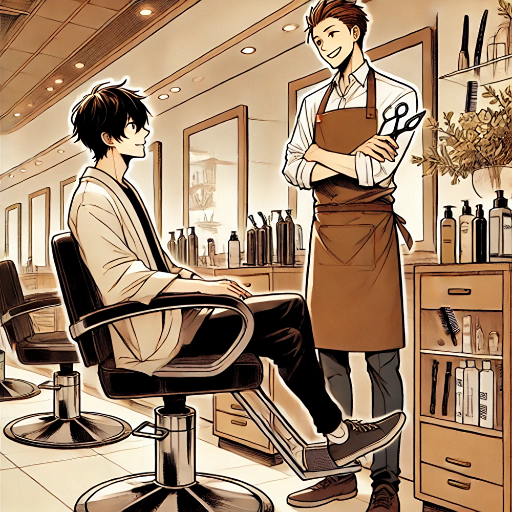

<!-- _class: lead -->

# itsumono

---

## コンセプト

「あなたのいつもをもっと快適に」

みなさん、美容院など髪を切るとき、美容師さんに「今日はどんな感じにしましょうか？」と聞かれて困ったことはありませんか。
いつも聞かれてから、どうしようと考えて、結局「前回と同じ感じで。」とお願いしちゃうことが多いです。

---

## プロダクトの価値提案

今回作った「いつもの髪型で」では：

- 髪を切ったときの写真（全面、左右、後ろ）を保存
- それぞれの髪型をデータベースに記録
- 「あのときの良かった髪型と同じに」という要望を視覚化
- 美容師さんとの円滑なコミュニケーションをサポート

**このプロダクト(いつものやつで)があれば、髪型を伝える面倒くさいは全て解決します！**

---

## Why Now

分散型の社会が進み、美容院も店舗とお客さんではなく、美容師の誰々さんと自分の P2P コミュニケーションとなり、自分に合った「いつもの」が求められていく時代になっていくと思うから。

---

## ビジネスモデル&収益化戦略

※全然検証はできていないので仮案です。

### BtoC

- アドセンス広告の配置

### BtoB

- 美容院へのシステム手数料（予約１名につきいくら）
- お客さん管理システムとしての月額利用料

初期アクションとしては、「SNS(Instagram)でお客さんとやりとりしている美容師さんをターゲットに営業」、その美容師さんのお客さんに向けてプロダクトを使ってもらうようにしていく。「いつものやつで」の無料部分だけでもお客さんにニーズがあれば、そこからより良い体験を有料化して提供していく。

---

## 主な要素

- いつもの美容院で（お気に入りの美容院を登録して、予約が簡単に）
- いつもの美容師さんで（お気に入りの美容師さんを登録できる）
- いつもの髪型で
- いつもの髪色で
- いつものヘアセットで

→ いつもがわかれば、少し変えたい時に、どんな感じにしたいかを伝えやすくなる。

---

## デモンストレーション

- 実際の画面遷移のスクリーンショット
- 主要機能の使用例（写真撮影 → 保存 → 共有のフロー）
- 美容師側の画面例

---

## SNS での現状

### 「美容院、いつもの」での検索結果

https://twitter.com/search?q=%E3%81%84%E3%81%A4%E3%82%82%E3%81%AE%E3%80%80%E7%BE%8E%E5%AE%B9%E9%99%A2&src=typed_query&f=top

### 「美容院、めんどくさい」での検索結果

https://twitter.com/search?q=%E3%82%81%E3%82%93%E3%81%A9%E3%81%8F%E3%81%95%E3%81%84%E3%80%80%E7%BE%8E%E5%AE%B9%E9%99%A2&src=typed_query&f=top

---

## MVP 機能：お客さん向け

- ログイン機能、アカウント登録機能、編集、削除、更新など
- WEB アプリで写真をとって、アップロードできる
- 前後ろ横が取れて、日付とコメント、自分なりの評価基準や点数やコメントなどを追加で入れとける
- いつどこで誰に切ってもらったかわかる
- お気に入りマークをつけれてそこだけ表示できる画面がある
- 日時や点数などで検索、ソートができて、美容師さんにこの時の髪型でお願いしますって話しやすい

---

## MVP 機能：美容師向け

- ログイン機能、アカウント登録機能、編集、削除、更新など
- ユーザーの写真を見ることができる
- ユーザーの写真にハイドコメントを残せる
- お客さんと「あの時の髪型で」という話しができるようになる

---

## 追加機能候補 (1/2)

- コメント機能に音声入力をつける
- GeminiAI API を使って、坊主、長髪、パーマなどの髪型にしたイメージ画像を見ることができる
- 好きな芸能人などの髪型をアップロードして、お気に入りに追加できる
- カレンダー機能で、その日の髪型を選択して、その日の髪型を表示できる

---

## 追加機能候補 (2/2)

- いつ髪を切ったかわかる
- 次回したい髪型を登録したら、今回の髪型画像から画像認識をして、ホーム画面にコメントのような吹き出しで次回どれくらいの周期で髪を切りに行けばいいか教えてくれる
- 嫁や家族がゲストユーザーとしてログインできて、写真にコメントを残せる

---

## 必要な技術

### フロントエンド

- HTML5
- CSS3
- JavaScript
  - 画像プレビュー機能
  - フォーム送信の非同期処理
  - 画像ギャラリーの実装
  - ソート・検索機能

### バックエンド

- PHP（認証、DB 操作、画像アップロード処理）
- MySQL

### その他

- レスポンシブデザイン
- ローカルストレージでの一時保存機能

---

## 美容院の課題と解決策 (1/3)

### 予約の課題

**理由**:

- 予定と予約を合わせるのが手間
- 希望する日時に空きがない
- 希望の美容師が休み

**解決策**:

- 施術時に次回の予約を入れる
- オンライン予約や LINE 予約を利用する
- 予約不要のカット専門店を利用する

---

## 美容院の課題と解決策 (2/3)

### コミュニケーションの課題

**理由**:

- 美容師が忙しくて電話がつながりにくい
- 電話をかけること自体が苦手
- 店員との会話が苦手
- 会話内容が好きではない
- 美容院という環境での会話が合わない

**解決策**:

- 電話以外の連絡方法がある美容院を選ぶ
- なじみの美容師に私用の LINE を教えてもらう
- 予約時に「会話なし」の要望を伝える
- 自分の興味のある話題に会話を誘導する
- 少人数スタッフの美容院を選ぶ

---

## 美容院の課題と解決策 (3/3)

### その他の課題と解決策

**料金が高い**:

- カット専門店を利用する
- セルフカットをする

**時間がかかる**:

- カット専門店を利用する
- 薬液を変えて時間を調整する

**お店の雰囲気・希望伝達**:

- 事前に Web サイトなどで雰囲気を確認する
- 写真を見せる
- 具体的な希望を伝える

**カラー**:

- カラーをやめることを検討する

---

## アプリの解決機能 (1/2)

1. **オンライン予約システム**

   - 空いている時間帯をカレンダー形式で表示
   - 簡単に予約が可能

2. **カット専門店の検索と予約**

   - シャンプーやブローが不要なカット専門店を検索
   - 口コミや評価を確認して予約

3. **セルフケアガイド**
   - 自宅でできる簡単なヘアケア方法
   - セルフカットの方法紹介

---

## アプリの解決機能 (2/2)

4. **スタイルコミュニケーションツール**

   - 希望のヘアスタイルを写真やイラストで伝達
   - 具体的な要望をテキストで保存・共有

5. **リマインダー機能**

   - 次回の美容院予約リマインド
   - ヘアケアのリマインダー通知

6. **ユーザープロファイル管理**
   - ヘアスタイルの履歴管理
   - 好みのスタイル記録
   - パーソナライズされたサービス提供
